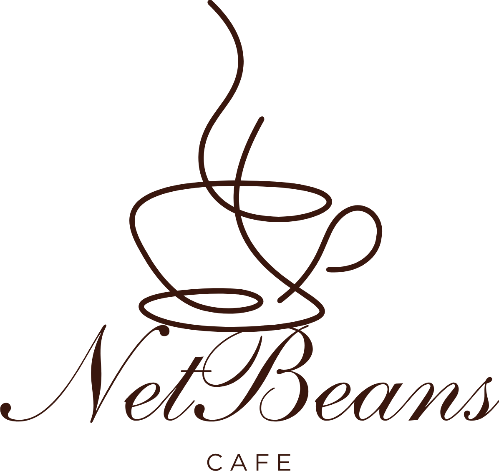

# Java DSA Cafe Management System



## ☕ Fuel For Your Code

Welcome to the Java DSA Cafe Management System! This project is a dual-interface application demonstrating the practical application of Data Structures and Algorithms (DSA) in Java. It features a robust Command-Line Interface (CLI) for system administrators and a beautiful, fully functional Web Dashboard for cafe staff, both powered by a custom-built Java HTTP Server.

This project was built from scratch with **zero external dependencies** (no Spring Boot, no Maven/Gradle required) to showcase core Java networking and algorithmic capabilities.

---

## ✨ Key Features

### 🧠 Data Structures & Algorithms
*   **Typed menu items:** `Drink` supports Small, Medium, and Large prices; `Pastry` uses a Standard price and currently contains placeholder catalog data.
*   **Size pricing (`MenuItem.java`):** Each item stores prices in a `HashMap<Size, Double>`.
*   **Ordered Array (`Inventory.java`):** Menu items are stored in a dynamically resizing array that is strictly maintained in ascending order by Item ID.
*   **Binary Search:** Locating menu items via ID operates in $O(\log n)$ time, ensuring lightning-fast lookups even with massive menus.
*   **Merge Sort:** A divide-and-conquer algorithm operating in $O(n \log n)$ time used to dynamically sort the menu by price (Ascending/Descending) on the fly, without breaking the original ID-based order.
*   **Shopping cart and FIFO queue:** A cart can contain multiple `CartItem` entries and is processed as one order through the thread-safe `ArrayDeque`.
*   **Order totals:** Cart totals are calculated from size-specific prices before submission and preserved with each queued order. The CLI and web dashboard display active-cart and submitted-order totals.
*   **Business summary:** The Summary dashboard reports menu size, pending orders, completed sales, items sold, revenue, and a timestamped sales history with the completing user.
*   **Thread Safety:** Critical data structures are synchronized to handle concurrent requests from the multithreaded web server and the main CLI thread without race conditions.

### 💻 Dual Interface Design
*   **Console CLI:** A comprehensive terminal interface offering raw, immediate access to all system functions. Perfect for backend management and server monitoring.
*   **Web Dashboard:** A responsive, modern Single Page Application (SPA) built with vanilla HTML/CSS/JS. It communicates with the Java backend via REST APIs.

### 🔒 Role-Based Access Control (RBAC) & Security
The web application features a secure, token-based authentication system built directly into the custom Java HTTP Server.
*   **Session Management:** Generates unique `UUID` Bearer tokens upon successful login, stored securely in a `ConcurrentHashMap`.
*   **Manager Role:** Full access. Can view queues, fulfill orders, and manage the menu (Add/Edit/Delete items).
*   **Barista Role:** Operational access. Can view the menu, place orders, and fulfill orders in the queue.
*   **Path Traversal Protection:** The static file server includes robust normalization checks to prevent unauthorized access to files outside the `web` directory.

### 🎨 Modern Web UI
*   **Light/Dark Mode:** Built-in theme toggling that remembers user preference via `localStorage`.
*   **Real-time Polling:** The Order Queue automatically updates every 3 seconds to reflect new orders placed via the CLI or other web clients.
*   **Toast Notifications:** Clean, unobtrusive UI feedback for API success/error states.
*   **Responsive Grid:** The menu adapts beautifully to any screen size.

---

## 🏗️ Data Structures & ADTs Architecture

This project intentionally isolates Abstract Data Types (ADTs) and relies on specific concrete Data Structures to ensure optimal performance, memory efficiency, and thread safety across the dual-interface system.

| Category | Name | File / Component | Purpose & Usage |
| :--- | :--- | :--- | :--- |
| **ADT** | **Ordered List** | `Inventory.java` | Manages the menu catalog. Strictly enforces sorted order by Item ID upon insertion to guarantee preconditions for algorithms like Binary Search. |
| **ADT** | **FIFO Queue** | `OrderQueue.java` | Manages pending customer orders. Ensures strictly First-In-First-Out (FIFO) processing for fair and chronological order fulfillment. |
| **Data Structure** | **Dynamic Array (`ArrayList`)** | `Inventory.java` | The underlying storage for the Ordered List ADT. Provides memory-contiguous $O(1)$ random access, which is mathematically required to achieve $O(\log n)$ efficiency during Binary Search. |
| **Data Structure** | **`ArrayDeque`** | `OrderQueue.java` | The underlying storage for the Queue ADT. Provides amortized $O(1)$ enqueue and dequeue operations at both ends. Chosen over `LinkedList` for superior memory efficiency and CPU cache locality (no node allocation overhead). |
| **Data Structure** | **`ConcurrentHashMap`** | `HTTPServer.java` | Stores active authentication sessions mapping UUID Tokens to User Roles. Provides thread-safe, lock-stripped $O(1)$ lookups and insertions, safely handling simultaneous requests from the multithreaded HTTP worker pool. |
| **Data Structure** | **`Record`** | `Order.java`, `CartItem.java` | Immutable data carriers for multi-item orders, sizes, quantities, customer aliases, and submitted total prices. |

---

## ⚙️ Explicit Algorithms Implemented

| Algorithm | Time Complexity | File | Purpose & Usage |
| :--- | :--- | :--- | :--- |
| **Binary Search** | $O(\log n)$ | `Inventory.java` | Rapidly locates menu items by ID. Used by the API (`?id=X`) and CLI for searching, updating, and removing items. Requires the underlying array to be pre-sorted. |
| **Merge Sort** | $O(n \log n)$ | `Inventory.java` | Dynamically creates a price-sorted copy of the menu. Uses a divide-and-conquer approach and is triggered by the Web UI sort dropdown (`?sortBy=price`). |
| **Ordered Insertion** | Amortized $O(n)$ | `Inventory.java` | Maintains the strictly ascending ID order of the Inventory array during new item additions, serving as the mathematically necessary precondition for Binary Search. |

---

## 🚀 Getting Started

### Prerequisites
*   Java Development Kit (JDK) 25 or higher.
*   An IDE (IntelliJ IDEA recommended).

### Project Structure
```text
DSAA/
├── src/
│   ├── HTTPServer.java       # Custom multi-threaded web server & REST API
│   ├── Inventory.java        # Ordered Array implementation w/ Binary Search & Merge Sort
│   ├── Main.java             # Entry point & CLI loop
│   ├── MenuItem.java         # Size-price map base model
│   ├── Drink.java            # Small/Medium/Large menu item
│   ├── Pastry.java           # Standard-size menu item
│   ├── Size.java             # Supported item sizes
│   ├── CartItem.java         # One shopping-cart line
│   ├── Order.java            # Multi-item order record
│   ├── CompletedSale.java    # Fulfilled order history record
│   └── OrderQueue.java       # Thread-safe FIFO Queue implementation
└── web/
    ├── index.html            # SPA Entry point & Layout
    └── assets/
        ├── css/
        │   └── style.css     # Theming, Layouts, and Animations
        ├── js/
        │   └── app.js        # API Calls, DOM Manipulation, State Management
        └── images/
            └── logo.jpg      # Branding
```

### Running the Application

1.  **Clone or Download** the project to your local machine.
2.  **Open the project** in IntelliJ IDEA (or your preferred IDE).
3.  Ensure the `src` folder is marked as your Sources Root.
4.  Configure the login passwords outside the source code. In PowerShell, for example:
    ```powershell
    $env:CAFE_ADMIN_PASSWORD = "choose-a-strong-manager-password"
    $env:CAFE_BARISTA_PASSWORD = "choose-a-strong-barista-password"
    ```
5.  Run `Main.java`.

The server binds to `0.0.0.0`, limits request and static-file sizes, expires sessions after 30 minutes, and supports `POST /api/logout` for session revocation. Use a reverse proxy with HTTPS before exposing it beyond the local machine.

You will see the HTTP Server start in the console, followed by the CLI menu:
```text
Cafe Server running at: http://localhost:8080/
==========================================
     WELCOME TO JAVA DSA CAFE SYSTEM      
==========================================

Select an option:
1. Search Item by ID (Binary Search)
...
```

### Accessing the Web Dashboard
1.  Open your web browser and navigate to `http://localhost:8080/`.
2.  Log in using the configured accounts:
    *   **Manager:** `admin` / the value of `CAFE_ADMIN_PASSWORD`
    *   **Barista:** `barista` / the value of `CAFE_BARISTA_PASSWORD`

---

## 📡 REST API Documentation

The `HTTPServer.java` exposes the following endpoints:

| Endpoint | Method | Role Required | Description | Request Body Example |
| :--- | :--- | :--- | :--- | :--- |
| `/api/login` | `POST` | *None* | Authenticates user and returns a temporary bearer token. | `{"username":"admin", "password":"..."}` |
| `/api/logout` | `POST` | Authenticated user | Revokes the current bearer session. | N/A |
| `/api/menu` | `GET` | *None* | Returns the full menu array. | N/A |
| `/api/menu?id=X`| `GET` | *None* | Performs a Binary Search and returns a specific item. | N/A |
| `/api/menu?sortBy=price`| `GET` | *None* | Performs a Merge Sort to return the menu ordered by price. Use `&desc=true` for High-to-Low. | N/A |
| `/api/menu` | `POST` | Manager | Adds a Drink or Pastry with size-specific prices. | `{"id":106,"name":"Tea","type":"Drink","smallPrice":120,"mediumPrice":140,"largePrice":160}` |
| `/api/menu` | `PUT` | Manager | Edits an existing item and its size-specific prices. | `{"id":106,"name":"Green Tea","type":"Drink","smallPrice":125,"mediumPrice":145,"largePrice":165}` |
| `/api/menu?id=X`| `DELETE` | Manager | Removes item ID 'X' from Inventory. | N/A |
| `/api/orders` | `GET` | Barista/Manager | Returns pending multi-item orders, including each submitted `totalPrice`. | N/A |
| `/api/orders` | `POST` | Barista/Manager | Enqueues a multi-item shopping cart. | `{"items":[{"itemId":101,"size":"SMALL","quantity":2}],"customerAlias":"John"}` |
| `/api/orders` | `DELETE`| Barista/Manager | Dequeues (fulfills) the next Order and returns its total price. | N/A |
| `/api/summary` | `GET` | Barista/Manager | Returns business metrics and completed sales history. | N/A |

*Note: All endpoints support `OPTIONS` requests for CORS preflight.*

---

## 🛠️ Built With

*   **Java 17:** Application logic, Data Structures, and standard library `com.sun.net.httpserver`.
*   **HTML5/CSS3:** Semantic structure and custom styling (CSS Variables for theming).
*   **Vanilla JavaScript (ES6+):** Asynchronous `fetch` API, DOM manipulation, and LocalStorage.

## 📝 License
This project is open-source and created for educational purposes demonstrating Data Structures and Algorithms. Feel free to use, modify, and distribute it!
